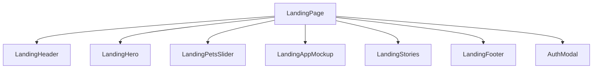

# Technical Design: Premium Landing Page Redesign

## Component Hierarchy

The redesigned landing page will follow a modular, atomic React structure:

### Components Summary
1. **`LandingPage.tsx`**: Host of the landing. Mounts all sub-sections. Manages scroll states, mounts dynamic absolute floating gradient blobs.
2. **`LandingHeader.tsx`**: Header with logo, text-nav, theme toggler (connected to `useTheme` hook), mobile hamburger menu toggle.
3. **`LandingHero.tsx`**: Promotional copywriting, CTA action buttons, floating tilted golden dog container with custom animations.
4. **`LandingPetsSlider.tsx`**: Scroll track utilizing Tailwind infinite scroll keyframe. Displays repeating `petsData` elements.
5. **`LandingAppMockup.tsx`**: Explanatory section of the app features + CSS tilted iPhone device mockup complete with navigation bar.
6. **`LandingStories.tsx`**: Snap-scrolling horizontal cards displaying happy adoption stories.
7. **`LandingFooter.tsx`**: Brand column + Platform column + Legal column + Contact details column + copyright.
8. **`AuthModal.tsx`**: Preserves exact business hooks (`useLogin`, `useRegister`), role select, error mapping, and form submission states, redressed in a clean aesthetic.

## Architecture Decisions

### Decision 1: Separation of Mockup Styling
Instead of massive inline stylesheets or separate SCSS, we rely entirely on Tailwind v4's CSS variable custom variables mapped to class names inside the HTML/TSX structures, keeping the style local and maintainable.

### Decision 2: Static Carousel for Visual Integrity
To ensure continuous smooth sliding without network latency, layout jumps, or empty states, the pets carousel is populated using static mock assets defined locally.
